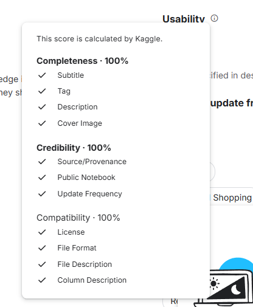

## The video I have uploaded was sped up to 3 minutes. Please ideally watch the video in 0.75* or 0.5* speed. There was no penalisation of video length or quality though according to track 4 rubrics, just the content of the video.##

Hey, this is my ACC102 minitask!

**Problem**: products look successful due to high revenue, but same said products are destroying profit margins.
**Data product**: Analyze sales and profitability across sub categories (product types, geographical branches, and discount rates of products) to identify what's actually losing money, even though it's selling well.
**Target Audience**: retail business managers who needs to decide which product categories to promote, discount, or discontinue.

**Dataset**:
- 'Superstore Sales Dataset'
 This is a synthetic dataset from Kaggle. This dataset contains 9994 records of retail sales transactions, with information of each transactions' sales, profit, product type, regions, and customer types. Total of 21 different columns. This dataset is publicly avaiable under a CC0 license, and follows realistic business patterns. This is also why it's widely used in academic works. Not only is it from Kaggle, a trusted dataset website, this dataset is also rated a '10/10' usability in Kaggle, further showing its reliability. 

**Features**:
- Interactive filters (Region, Customer Segment, Product Category, Discount Range); visible at the left side of the screen
- Profit analysis by product sub-category
- Profit margin percentage analysis
- Discount vs profit correlation scatter plot (hover for product details)
- Regional profit breakdown
- Customer segment profit breakdown
- Profit killers deep dive table
- Automated business recommendations
- Action plan summary

**How to run my app**
1. download this repository 
2. Install the required packages. User can do this by typing 'pip install -r requirements.txt' in the terminal. This is because all Python package and exact version needed are in there. (I got this from using the 'python -m pip freeze > requirements.txt' function)
3. Run this command in the terminal 'streamlit run app.py'
4. Have fun

**Some key findings my app made**
- Tables and Bookcases have a high negative profit margins despite significant sales volume
- Furniture has the lowest profit margin of only 2.5%, whereas office supplies and technology related products have similar profit margins of 17.4% and 17% profit accordingly
- Discounts above 30% usually correlates to a loss 
- The east region usually perfoms worse compared to the other regions
- Businesses usually get most their profit from businesses or corporate customers compared to other consumer 

**potential limitations**
- Though reliable, data is still synthetic
- Correlations doesn't prove causations

## AI tools, namely DeepSeek AI were used to assist me with code structure, debugging, and generating initial plot configurations. Additionally, ChatGPT was used to helped me generate ideas to implement inside my app. All code was reviewed, adapted, and understood by the student.
